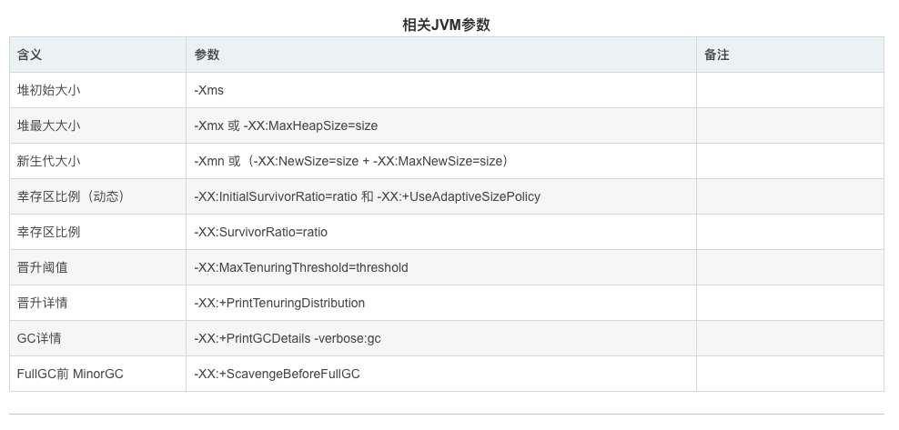

#  Java垃圾回收机制
### 目录
### 1、如何判断对象可以回收
#### 1.1 引用计数法
&nbsp;&nbsp;&nbsp;&nbsp;每个对象有一个引用计数器，当对象被引用一次则计数器加1，当对象引用失效一次则计数器减1，
对于计数器为0的对象意味着是垃圾对象，可以被GC回收
- 引用计数法优点：实现逻辑简单
- 引用计数法缺点：无法解决循环引用问题；目前没有在使用
  

#### 1.2 可达性分析算法
&nbsp;&nbsp;&nbsp;&nbsp;从GC Roots作为起点开始搜索，那么整个连通图中的对象便都是活对象，对于GC Roots无法到达的对象便成了垃圾回收的对象，随时可被GC回收。
- Java 虚拟机中的垃圾回收器采用**可达性分析**来探索所有存活的对象
- 扫描堆中的对象，看是否能够沿着 GC Root 对象 为起点的引用链找到该对象，找不到表示可以回收
- 可以作为GC Root的对象
  - 虚拟机栈（栈帧中的本地变量表）中引用的对象。　
  - 方法区中类静态属性引用的对象
  - 方法区中常量引用的对象
  - 本地方法栈中JNI（即一般说的Native方法）引用的对象

#### 1.3 四种引用：强、软、弱、虚引用

##### 1.3.1 强引用
只有所有GC Root对象都不通过【强引用】引用该对象，该对象才能进行垃圾回收
 - 如上图B、C对象都不引用A1对象时，A1对象才会被回收
##### 1.3.2 软引用
- 仅有软引用引用该对象时，在垃圾回收后，内存仍不足时会再次触发垃圾回收，回收软引用对象(当GC Root指向软引用对象时，在内存不足时，会回收软引用所引用的对象)
  - 如上图如果B对象不再引用A2对象且内存不足时，软引用所引用的A2对象就会被回收
###### 软引用的使用
``` 
public class Demo1 {
	public static void main(String[] args) {
		final int _4M = 4*1024*1024;
		//使用软引用对象 list和SoftReference是强引用，而SoftReference和byte数组则是软引用
		List<SoftReference<byte[]>> list = new ArrayList<>();
		SoftReference<byte[]> ref= new SoftReference<>(new byte[_4M]);
	}
}
``` 
- 如果在垃圾回收时发现内存不足，在回收软引用所指向的对象时，**软引用本身不会被清理**
  - 可以配合引用队列来释放软引用自身(如果想要清理软引用，需要使用引用队列)
``` 
public class Demo1 {
	public static void main(String[] args) {
		final int _4M = 4*1024*1024;
		//使用引用队列，用于移除引用为空的软引用对象
		ReferenceQueue<byte[]> queue = new ReferenceQueue<>();
		//使用软引用对象 list和SoftReference是强引用，而SoftReference和byte数组则是软引用
		List<SoftReference<byte[]>> list = new ArrayList<>();
		SoftReference<byte[]> ref= new SoftReference<>(new byte[_4M]);

		//遍历引用队列，如果有元素，则移除
		Reference<? extends byte[]> poll = queue.poll();
		while(poll != null) {
			//引用队列不为空，则从集合中移除该元素
			list.remove(poll);
			//移动到引用队列中的下一个元素
			poll = queue.poll();
		}
	}
}
``` 
**大概思路**为：查看引用队列中有无软引用，如果有，则将该软引用从存放它的集合中移除（这里为一个list集合）

##### 1.3.3 弱引用
- 只有弱引用引用该对象时，在垃圾回收时，**无论内存是否充足**，都会回收弱引用所引用的对象
  - 如上图如果B对象不再引用A3对象，则A3对象会被回收 
- 弱引用的使用和软引用类似，只是将 SoftReference 换为了 WeakReference(可以配合引用队列来释放弱引用自身)

##### 1.3.4 虚引用
- (当虚引用对象所引用的对象被回收以后，虚引用对象就会被放入引用队列中，调用虚引用的方法)必须配合引用队列使用，主要配合ByteBuffer使用，被引用对象回收时，会将虚引用入队，由Reference Handler线程调用虚引用相关方法释放直接内存
   - 虚引用的一个体现是**释放直接内存**所分配的内存，当引用的对象ByteBuffer被垃圾回收以后，虚引用对象Cleaner就会被放入引用队列中，然后调用Cleaner的clean方法来释放直接内存
   - 如上图，B对象不再引用ByteBuffer对象，ByteBuffer就会被回收。但是直接内存中的内存还未被回收。这时需要将虚引用对象Cleaner放入引用队列中，然后调用它的clean方法来释放直接内存
##### 1.3.5 终结器引用
- (所有的类都继承自Object类，Object类有一个finalize方法。当某个对象不再被其他的对象所引用时，会先将终结器引用对象放入引用队列中，然后根据终结器引用对象找到它所引用的对象，然后调用该对象的finalize方法。调用以后，该对象就可以被垃圾回收了)无需手动编码，但其内部配合引用队列使用，在垃圾回收时，终结器引用入队（被引用对象暂时没有被回收），再由Finalizer线程通过终结器引用找到被引用对象并调用它的 finalize方法，第二次GC 时才能回收被引用对象
   -  如上图，B对象不再引用A4对象。这是终结器对象就会被放入引用队列中，引用队列会根据它，找到它所引用的对象。然后调用被引用对象的finalize方法。调用以后，该对象就可以被垃圾回收了
##### 1.3.6 引用队列
- 软引用和弱引用可以配合引用队列
  - 在弱引用和虚引用所引用的对象被回收以后，会将这些引用放入引用队列中，方便一起回收这些软/弱引用对象
- 虚引用和终结器引用必须配合引用队列
  - 虚引用和终结器引用在使用时会关联一个引用队列
    
### 2、垃圾回收算法
#### 2.1 标记清除
[//]: # (![标记清除]&#40;images/垃圾回收/20200608150813.png&#41;)


#####  **定义:** Mark Sweep
标记清除算法顾名思义，是指在虚拟机执行垃圾回收的过程中，先采用标记算法确定可回收对象，然后垃圾收集器根据标识清除相应的内容，给堆内存腾出相应的空间
 - 这里的腾出内存空间并不是将内存空间的字节清0，而是记录下这段内存的起始结束地址，下次分配内存的时候，会直接覆盖这段内存<br/>
##### **描述:** 
分为标记和清除两阶段：首先标记出所有需要回收的对象，然后统一回收所有被标记的对象。
##### **特点** 
 - 速度较快
 - 会造成内存碎片，导致在程序运行过程中需要分配较大对象的时候，无法找到足够的连续内存而不得不提前触发一次垃圾收集动作。
 - 容易产生大量的内存碎片，可能无法满足大对象的内存分配，一旦导致无法分配对象，那就会导致jvm启动gc，一旦启动gc，我们的应用程序就会暂停，这就导致应用的响应速度变慢

#### 2.2 标记整理

[//]: # (![标记整理]&#40;images/垃圾回收/20200608150827.png&#41;)


#####  **定义:** Mark Compact
##### **描述:** 
 - 标记过程仍然与“标记-清除”算法一样，但后续步骤不是直接对可回收对象进行清理，而是<font color="#f33b45">让所有存活的对象都向一端移动，然后直接清理掉端边界以外的内存。</font>
 - 会将不被GC Root引用的对象回收，清楚其占用的内存空间。然后整理剩余的对象，可以有效避免因内存碎片而导致的问题，但是因为整体需要消耗一定的时间，所以效率较低
##### **特点** 
- 速度慢
- 没有内存碎片
#### 2.3 复制

[//]: # (![复制]&#40;images/垃圾回收/20200608150842.png&#41;)


[//]: # (![复制]&#40;images/垃圾回收/20200608150856.png&#41;)


[//]: # (![复制]&#40;images/垃圾回收/20200608150907.png&#41;)


[//]: # (![复制]&#40;images/垃圾回收/20200608150919.png&#41;)

#####  **定义:** Copy
##### **描述:**
- 将内存分为等大小的两个区域，FROM和TO（TO中为空）。先将被GC Root引用的对象从FROM放入TO中，再回收不被GC Root引用的对象。然后交换FROM和TO。这样也可以避免内存碎片的问题，但是会占用双倍的内存空间。
- 将可用内存容量划分为大小相等的两块，每次只用其中一块。当这块内存用完了，就将还存活的对象复制到另外一块上面，然后再把已使用过的内存空间一次清理掉。
   - 不会有内存碎片，但效率也不是很高
   - 需要占用双倍内存空间
##### **特点**
**优点**：自带整理功能，这样不会产生大量不连续的内存空间，适合年轻代垃圾回收。

### 3、分代垃圾回收
[//]: # (![分代垃圾回收]&#40;images/垃圾回收/20200608150931.png&#41;)

当前商业虚拟机的垃圾收集都采用分代收集。此算法没啥新鲜的，就是将上述三种算法整合了一下。具体如下：
根据各个年代的特点采取最适当的收集算法：
1. 在新生代中，每次垃圾收集时候都发现有大批对象死去，只有少量存活，那就选用复制算法。只需要付出少量存活对象的复制成本就可以完成收集。
2. 老年代中因为对象存活率高、没有额外空间对他进行分配担保，就必须用标记-清除或者标记-整理。
   
  - 对象首先分配在伊甸园区域
  - 新生代空间不足时，触发minor gc，伊甸园 和 from存活的对象使用 copy 复制到 to中，存活的对象年龄加1 并且交换 from to
  - minor gc 会引发stop the word，暂停其它用户线程，等垃圾回收结束，用户线程才恢复运行
  - 当对象寿命超过阈值时，会晋升至老年代，最大寿命15 （4bit）
  - 当老年代空间不足，会先尝试触发minor gc，如果之后空间仍不足，那么触发full gc，STW的时间更长
#### 3.1 回收流程
新创建的对象都被放在了**新生代的伊甸园**中

[//]: # (![回收流程]&#40;images/垃圾回收/20200608150939.png&#41;)

当伊甸园中的内存不足时，就会进行一次垃圾回收，这时的回收叫做 **Minor GC**
Minor GC 会将**伊甸园和幸存区FROM**存活的对象先复制到 **幸存区** TO中，
并让其**寿命加1**，再交换两个幸存区


[//]: # (![回收流程]&#40;images/垃圾回收/20200608150946.png&#41;)


[//]: # (![回收流程]&#40;images/垃圾回收/20200608150955.png&#41;)
[//]: # (![回收流程]&#40;images/垃圾回收/20200608151002.png&#41;)

再次创建对象，若新生代的伊甸园又满了，则会**再次触发** Minor GC（会触发 **stop the world**， 暂停其他用户线程，只让垃圾
回收线程工作），这时不仅会回收伊甸园中的垃圾，**还会回收幸存区中的垃圾**，再将活跃对象复制到幸存区TO中。回收以后会交换两个幸存区，并让幸存区中的对象**寿命加1**


[//]: # (![分代垃圾回收]&#40;images/垃圾回收/20200608151010.png&#41;)
如果幸存区中的对象的**寿命超过某个阈值**（最大为15，4bit），就会被放入老年代中

[//]: # (![分代垃圾回收]&#40;images/垃圾回收/20200608151018.png&#41;)

如果新生代老年代中的内存都满了，就会先触发Minor GC，再触发Full GC，扫描新生代和老年代中所有不再使用的对象并回收

#### 3.2 GC 分析
##### 大对象处理策略
当遇到一个较大的对象时，就算新生代的伊甸园为空，也无法容纳该对象时，会将该对象直接晋升为老年代
##### 线程内存溢出
某个线程的内存溢出了而抛异常（out of memory），不会让其他的线程结束运行
这是因为当一个线程抛出OOM异常后，它所占据的内存资源会全部被释放掉，从而不会影响其他线程的运行，进程依然正常


#### 3.3 相关JVM参数

### 4、垃圾回收器
#### 4.1 相关概念
##### **并行收集：** 指多条垃圾收集线程并行工作，但此时用户线程仍处于等待状态。
##### **并发收集：** 指用户线程与垃圾收集线程同时工作（不一定是并行的可能会交替执行）。用户程序在继续运行，而垃圾收集程序运行在另一个CPU上
##### **吞吐量：** 即CPU用于运行用户代码的时间与CPU总消耗时间的比值（吞吐量 = 运行用户代码时间 / ( 运行用户代码时间 + 垃圾收集时间 )），也就是。例如：虚拟机共运行100分钟，垃圾收集器花掉1分钟，那么吞吐量就是99%

#### 4.2 串行
##### 描述： Serial（串行）垃圾收集器是最基本、发展历史最悠久的收集器；JDK1.3.1前是HotSpot新生代收集的唯一选择；
 - 单线程
 - 内存较小，个人电脑（CPU核数较少）
 - 针对新生代
 - 采用复制算法
 - 进行垃圾收集时，必须暂停所有工作线程，直到完成
 - 堆内存较小，适合个人电脑
``` 
-XX:+UseSerialGC = Serial + SerialOld  // -XX:+UseSerialGC   添加该参数来显示的使用串行垃圾收集器
``` 
   
   
###### **安全点**：让其他线程都在这个点停下来，以免垃圾回收时移动对象地址，使得其他线程找不到被移动的对象
因为是串行的，所以只有一个垃圾回收线程。且在该线程执行回收工作时，其他线程进入阻塞状态
###### Serial 收集器
Serial收集器是最基本的、发展历史最悠久的收集器
特点：单线程、简单高效（与其他收集器的单线程相比），采用复制算法。
对于限定单个CPU的环境来说，Serial收集器由于没有线程交互的开销，
专心做垃圾收集自然可以获得最高的单线程手机效率。收集器进行垃圾回收时，
必须暂停其他所有的工作线程，直到它结束（Stop The World）
###### ParNew 收集器
ParNew收集器其实就是Serial收集器的多线程版本
特点：多线程、ParNew收集器默认开启的收集线程数与CPU的数量相同，
在CPU非常多的环境中，可以使用-XX:ParallelGCThreads参数来限制垃圾
收集的线程数。和Serial收集器一样存在Stop The World问题
###### **Serial Old 收集器**
Serial Old是Serial收集器的老年代版本
特点：同样是单线程收集器，采用标记-整理算法
#### 4.3 吞吐量优先
- 多线程
- 堆内存较大，多核CPU
- 单位时间内，STW（stop the world，停掉其他所有工作线程）时间最短0.2  0.2 = 0.4
- JDK1.8默认使用的垃圾回收器
``` 
-XX:+UseParallelGC    ~    -XX:+UseParallelOldGC // JDK1.8默认开启，只要开启UseParallelGC，就对应开启
-XX:+UseAdaptiveSizePolicy  // 自适应动态调整伊甸园和幸存区的内存比例
-XX:GCTimeRatio=ratio       // 目标1：1 / (1 + ratio)  一般设置ratio为19，20分钟垃圾回收不超过1分钟；会动态调整堆空间大小适应
-XX:MaxGCPauseMillis=ms     // 目标2：最大暂停用户线程时间，默认200ms
-XX:ParallelGCThreads=n     // 垃圾回收线程数                          // 垃圾回收时，CPU会飚得很高 
``` 
  
  
##### Parallel Scavenge 收集器
与吞吐量关系密切，故也称为吞吐量优先收集器

**特点**：属于新生代收集器也是采用复制算法的收集器（用到了新生代的幸存区），又是并行的多线程收集器（与ParNew收集器类似）

该收集器的目标是达到一个可控制的吞吐量。还有一个值得关注的点是：GC自适应调节策略（与ParNew收集器最重要的一个区别）

**GC自适应调节策略**：Parallel Scavenge收集器可设置-XX:+UseAdptiveSizePolicy参数。当开关打开时不需要手动指定新生代的大小（-Xmn）、Eden与Survivor区的比例（-XX:SurvivorRation）、晋升老年代的对象年龄（-XX:PretenureSizeThreshold）等，虚拟机会根据系统的运行状况收集性能监控信息，动态设置这些参数以提供最优
的停顿时间和最高的吞吐量，这种调节方式称为GC的自适应调节策略。

Parallel Scavenge收集器使用两个参数控制吞吐量：
 - XX:MaxGCPauseMillis 控制最大的垃圾收集停顿时间
 - XX:GCRatio 直接设置吞吐量的大小

##### Parallel Old 收集器
是Parallel Scavenge收集器的老年代版本

**特点**：多线程，采用标记-整理算法（老年代没有幸存区）

#### 4.4 响应时间优先
- 多线程
- 堆内存较大，多核CPU
- 尽可能让单次STW时间变短（尽量不影响其他线程运行）0.1  0.1  0.1  0.1  0.1 = 0.5
```
-XX:+UseConcMarkSweepGC   ~    -XX:+UseParNewGC     ~     SerialOld
-XX:ParallelGCThreads=n   ~    -XX:ConcGCThread=threads // ParallelGCThreads为4，则ConcGCThread应该是ParallelGCThreads的1/4，对CPU占用没有Par那么高
-XX:CMSInitiatingOccupancyFraction=percent // 执行CMS执行占比，预留空间给浮动垃圾
-XX:+CMSScavengeBeforeRemark   // 在CMS垃圾标记前开启新生代垃圾回收，这样重新标记对象要少得多，Full GC时间从接近2秒，降低到300ms左右
//CMS致命问题：CMS会产生内存碎片，如果内存碎片过多，垃圾回收会退化到SerialOld单线程垃圾回收器
``` 


##### **CMS 收集器**
Concurrent Mark Sweep，一种以获取最短回收停顿时间为目标的老年代收集器
**特点**：基于标记-清除算法实现。并发收集、低停顿，但是会产生内存碎片

**应用场景**：适用于注重服务的响应速度，希望系统停顿时间最短，给用户带来更好的体验等场景下。如web程序、b/s服务

**CMS收集器的运行过程分为下列4步：**

**初始标记：** 标记GC Roots能直接到的对象。速度很快但是仍存在Stop The World问题

**并发标记：** 进行GC Roots Tracing 的过程，找出存活对象且用户线程可并发执行

**重新标记：** 为了修正并发标记期间因用户程序继续运行而导致标记产生变动的那一部分对象的标记记录。仍然存在Stop The World问题

**并发清除：** 对标记的对象进行清除回收

CMS缺点：因为与用户工作程一起并发执行，所以会边清理，一边会产生新的垃圾

CMS收集器的内存回收过程是与用户线程一起并发执行的

**JAVA 堆垃圾回收示例：**
``` 
// GC 分析 大对象OOM
public class T01_Gc_Demo01 {
    private static final int _512KB = 512 * 1024;
    private static final int _1MB = 1024 * 1024;
    private static final int _6MB = 6 * 1024 * 1024;
    private static final int _7MB = 7 * 1024 * 1024;
    private static final int _8MB = 8 * 1024 * 1024;
 
    // -Xms20M -Xmx20M -Xmn10M -XX:+UseSerialGC -XX:+PrintGCDetails -verbose:gc
    public static void main(String[] args) throws InterruptedException {
//        ArrayList<byte[]> list = new ArrayList<>();
//        list.add(new byte[_8MB]);
//        list.add(new byte[_8MB]);
 
        // 一个线程OOM，不会导致整个进程挂掉
        new Thread(() -> {
            ArrayList<byte[]> list = new ArrayList<>();
            list.add(new byte[_8MB]);
            list.add(new byte[_8MB]);
        }, "Thread01").start();
 
        System.out.println("sleep...");
        TimeUnit.SECONDS.sleep(10);
    }
}
```
#### 4.5 G1 垃圾回收器
##### 定义：Garbage First，优先回收最有价值的垃圾区域，达到暂停时间不短的目标
  - 2004 论文发布
  - 2009JDK 6u14体验
  - 2012 JDK 7u4官方支持
  - <font color="#f33b45">2017 JDK 9默认，同时废弃了CMS垃圾回收</font>

    
#####  适用场景
   - 同时注重<font color="#f33b45">吞吐量（Throughput）和低延迟（Low latency）</font>，默认的暂停目标是200ms
   - <font color="#f33b45">超大堆内存</font>，会将堆划分为多个大小相等的Region (区域)
   - 整体上是标记 + 整理算法，两个区域之间是复制算法

**相关参数：** JDK8 并不是默认开启的，所需要参数开启
 - -XX:+UseG1GC
 - -XX:G1HeapRegionSize=size   // 设置Region区域大小
 - -XX:MaxGCPauseMillis=time   // 设置暂停目标，默认是200ms

总结:<font color="#f33b45">G1垃圾回收器，使用标记-整理算法，可以避免CMS标记-清除算法产生的内存碎片问题；在两个Region区域之间，则是使用复制算法。JDK8没有默认G1垃圾回收器，需要手动开启G1</font>

##### G1垃圾回收阶段

- Young Collection
- Young Collection + Concurrent Mark
- Mixed Collection

新生代伊甸园垃圾回收—–>内存不足，新生代回收+并发标记—–>回收新生代伊甸园、幸存区、老年代内存——>新生代伊甸园垃圾回收(重新开始)

##### Young Collection 新生代回收
**分区算法region**
分代是按对象的生命周期划分，分区则是将堆空间划分连续几个不同小区间，每一个小区间独立回收，可以控制一次回收多少个小区间，方便控制 GC 产生的停顿时间

E：伊甸园 S：幸存区 O：老年代
- 会STW
  
如果伊甸园进行垃圾回收，则会将伊甸园区存活的对象使用复制算法到Survivor区
  
  当Survivor进行垃圾回收时，对象年龄超过15次，放入老年代；年龄不足15次放入另一个Survivor区域
  

##### Young Collection + CM（新生代回收+CM）
CM: 并发标记
- 在 Young GC 时会对 GC Root 进行初始标记
- 在老年代占用堆内存的比例达到阈值时，对进行并发标记（不会STW），阈值可以根据用户来进行设定

-XX:InitiatingHeapOccupancyPercent=percent (默认45%)


##### Mixed Collection (混合回收)
会对E、S、O进行全面垃圾回收
- <font color="#f33b45">最终标记（Remark）会STW</font>
- <font color="#f33b45">拷贝存活（Evacuation）会STW ，并不是所有老年代区域都会回收，而是回收最有价值</font>

-XX:MaxGCPauseMills:xxx 用于指定最长的停顿时间

问：为什么有的老年代被拷贝了，有的没拷贝？

因为指定了最大停顿时间，如果对所有老年代都进行回收，耗时可能过高。为了保证时间不超过设定的停顿时间，会回收最有价值的老年代（回收后，能够得到更多内存）
##### Full GC
- Serial GC
  -  新生代内存不足发生的垃圾收集 - minor gc
  -  老年代内存不足发生的垃圾收集 - full gc
- Parallel GC
  -  新生代内存不足发生的垃圾收集 - minor gc
  -  老年代内存不足发生的垃圾收集 - full gc
- CMS
  -  新生代内存不足发生的垃圾收集 - minor gc
  -  老年代内存不足，当回收速度高于垃圾产生的速度，后台不会有full gc字样
- Serial GC
  -  新生代内存不足发生的垃圾收集 - minor gc
  -  老年代内存不足，当回收速度高于垃圾产生的速度，后台不会有full gc字样
  
##### Young Collection 跨代引用
- 新生代回收的跨代引用（老年代引用新生代）问题
  - 如果遍历整个老年代根对象，显然效率会非常低；老年代设计对应一个卡表，每个卡512K，如果某个卡中的对象引用了对象，我们将此卡标记为脏卡，减少扫描范围，提升垃圾回收效率。

- 卡表与Remembered Set
  - Remembered Set 存在于E中，用于保存新生代对象对应的脏卡
    - 脏卡：O被划分为多个区域（一个区域512K），如果该区域引用了新生代对象，则该区域被称为脏卡
- 在引用变更时通过post-write barried + dirty card queue
- concurrent refinement threads 更新 Remembered Set


##### Remark 重标记
重新标记阶段,在垃圾回收时，收集器处理对象的过程中,黑色：已被处理，需要保留的 灰色：正在处理中的 白色：还未处理的

但是在并发标记过程中，有可能A被处理了以后未引用C，但该处理过程还未结束，在处理过程结束之前A引用了C，这时就会用到remark
过程如下
  - 之前C未被引用，这时A引用了C，就会给C加一个写屏障，写屏障的指令会被执行，将C放入一个队列当中，并将C变为 处理中 状态
  - 在并发标记阶段结束以后，重新标记阶段会STW，然后将放在该队列中的对象重新处理，发现有强引用引用它，就会处理它


##### JDK 8u20 字符串去重
过程:
- 将所有新分配的字符串（底层是char[]）放入一个队列
- 当新生代回收时，G1并发检查是否有重复的字符串
- 如果字符串的值一样，就让他们引用同一个字符串对象
- 注意，其与String.intern的区别
  - intern关注的是字符串对象
  - 字符串去重关注的是char[]
  - 在JVM内部，使用了不同的字符串标
 
缺点与缺点:
- 节省了大量内存
- 新生代回收时间略微增加，导致略微多占用CPU

-XX:+UseStringDeduplication  // 使用此功能，需要打开此配置，默认是打开
```
String s1 = new String("hello"); // char[]{'h','e','l','l','o'}
String s2 = new String("hello"); // char[]{'h','e','l','l','o'}
```
##### JDK 8u40 并发标记类卸载
所有对象都经过并发标记后，就能知道哪些类不再被使用，当一个类加载器的所有类都不再使用，则卸载它所加载的所有类
-XX:+ClassUnloadingWithConcurrentMark 默认启用
##### JDK 8u60 回收巨型对象
- 一个对象大于region的一半时，称之为巨型对象
- G1 不会对巨型对象进行拷贝
- 回收时被优先考虑
- G1 会跟踪老年代所有 incoming 引用，这样老年代incoming 引用为0的巨型对象就可以在新生代垃圾回收时处理掉


##### JDK 9 并发标记起始时间的调整
- 并发标记必须在堆空间占满前完成，否则退化为Full GC （如果垃圾回收回收速度跟不上垃圾产生的速度，最终会Full GC）
- JDK9 之前需要使用 -XX:InitiatingHeapOccupancyPercent  (默认45%)
- JDK9 可以动态调整，更加合理；尽可能避免并发垃圾回收退化Full GC垃圾回收
  - -XX:InitiatingHeapOccupancyPercent 用来设置初始值
  - 进行数据采样并动态调整
  - 总会添加一个安全的空档空间
##### JDK9 更高效的回收
- 250+ 增强
- 180+bug 修复
- [https://docs.oracle.com/en/java/javase/12/gctuning]()
- G1 更加成熟、更加稳定
### 5、垃圾回收调优
预备知识
  - 掌握GC 相关的JVM参数，会基本的空间调整
    -  主要参考官网、更权威：[https://docs.oracle.com/en/java/javase/11/tools/java.html](主要参考官网、更权威：https://docs.oracle.com/en/java/javase/11/tools/java.html)
    -  查看虚拟机运行参数：java -XX:+PrintFlagsFinal -version | findstr "GC"
  - 掌握相关工具
  - 明白一点：调优跟应用、环境有关、没有放之四海纳而皆准的法则
调优原则：让长时间存活对象尽快晋升，如果长时间存活对象大量停留在新生代，新生代采用复制算法，复制来复制去，性能较低而且是个负担
查看虚拟机参数命令
```
"F:\JAVA\JDK8.0\bin\java" -XX:+PrintFlagsFinal -version | findstr "GC"
```
#### 5.1 调优领域
- 内存
- 锁竞争
- CPU占用
- IO
- GC

#### 5.2 确定目标
低延迟/高吞吐量？ 选择合适的GC
- CMS G1 ZGC
- ParallelGC
- Zing

科学运算，追求高吞吐量；互联网项目追求低延迟；高吞吐量垃圾回收，目前没有太多选择就一下ParallelGC；

低延迟垃圾回收，可以选CMS，G1， ZGC。目前互联公司还是很多在用CMS，JDK9 默认G1，不推荐CMS；因为CMS采用标记-清除算法会产生内存碎片，内存碎片多了之后会退化为serialOld，产生大幅度、长时间停顿，给用户的体验是不稳定

#### 5.3 最快的GC是不生发GC
首先排除减少因为自身编写的代码而引发的内存问题
- 查看Full GC前后的内存占用，考虑以下几个问题  
    - 数据是不是太多？
        - resultSet = statement.executeQuery("select * from 大表") ，可以加限定条数 limit n
    - 数据表示是否太臃肿
        - 对象图
        - 对象大小(java对象最小也是16字节，Integer 16字节， int 4；所以我们在选则数据类型时尽量选用基本数据类型)
    - 是否存在内存泄漏
        - 比如定义了一个静态的Map，static Map map = ，然后不停地向里面添加数据
        - 在内存紧张时，可以使用软引用
        - 在内存不足时，可以使用弱引用
        - 缓存数据时，尽量使用第三方缓存实现，比如redis/memcache，减少对堆内存依赖

#### 5.4 新生代调优
- 新生代的特点
   - 所有的new 操作的内存分配非常廉价
     - TLAB  thread-local allocation buffer，线程局部缓冲区，线程使用自己私有区域分配对象内存
   - 死亡对象的回收代价是零；因为采用复制算法，存活的对象使用复制算法到Survivor区域，剩下都是需要被回收的
   - 大部分对象用过即死，只有少数对象存活
   - Minor GC 的时间远远低于Full GC
   - 新生代优化空间更大一些
- 新生代内存越大越好么？
   -  不是
      - 新生代内存太小：频繁触发Minor GC，会STW，会使得吞吐量下降
      - 新生代内存太大：老年代内存占比有所降低，会更频繁地触发Full GC。而且触发Minor GC时，清理新生代所花费的时间会更长
   -  新生代内存设置为内容纳[并发量*(请求-响应)]的数据为宜

**幸存区调优**
   -  幸存区需要能够保存 当前活跃对象+需要晋升的对象
   - 晋升阈值配置得当，让长时间存活的对象尽快晋升

如何给新生代调优呢？是不是将新生代内存调得越大越好？下面是Oracle官方文档说明截图
网页链接：[https://docs.oracle.com/en/java/javase/11/tools/java.html#GUID-3B1CE181-CD30-4178-9602-230B800D4FAE](网页链接：https://docs.oracle.com/en/java/javase/11/tools/java.html#GUID-3B1CE181-CD30-4178-9602-230B800D4FAE)


上述大致中文翻译：设置年轻代的堆的初始大小和最大大小（以字节为单位）。 字母k或K表示千字节，m或M表示兆字节，g或G表示千兆字节。 堆的年轻代区域用于新对象。 与其他区域相比，在该区域执行GC的频率更高。 如果年轻代设置太小，则会执行大量 minor gc垃圾回收。 如果设置太大，则仅执行full gc垃圾回收才有效，这可能需要很长时间才能完成。 Oracle官方建议设置年轻代的大小保持大于堆总大小的25％，并且小于堆总大小的50％。
<hr/>
<font color="#f33b45">总结：</font> 新生代，还是需要调大一些，因为新生代采用复制算法，需要移动对象，复制算法性能效率较低。

<font color="#f33b45">公式：</font> 新生代能容纳所有【并发量 * （请求 - 响应）】的数据
 - 幸存区大到能保留【当前活跃对象 + 需要晋升对象】，原则就是让真正需要进入老年代的对象才进入老年代。
 - 晋升阈值配置得当，让长时间存活对象尽快晋升
   -XX:MaxTenuringThreshold=threshold     //  设置年龄阈值，大值为15。并行（吞吐量）收集器的默认值为15，而CMS收集器的默认值为6。
   -XX:+PrintTenuringDistribution                  //  启用打印保有权年龄信息，这个参数对于设置-XX:MaxTenuringThreshold有很大帮助，阀值需要长时间观察对象分布，设置合理即可。
#### 5.5 老年代调优
以CMS 为例
  - CMS的老年代内存越大越好
  - 先尝试不做调优，如果没有Full GC 那么老年代已经足够大了；如果有Full GC 则先尝试调优新生代
  - 观察发生Full GC 时老年代内存占用，将老年代内存预设调大 1/4  ~  1/3  
    - -XX:CMSInitiatingOccupancyFraction=percent    // 控制老年代占用空间大小占总空间大小比例，进行CMS垃圾回收；值越小就越早进行垃圾回收，推特工程师有一个演讲建议将此值设置为0，即一有垃圾就回收；一般我们将此值设置75%~80%之间，预留25%-20%给浮动垃圾

#### 5.6 案例
  - 案例1：Full GC 和Minor GC频繁(一分钟上百次)，意味着堆内存空间紧张，可能是新生代空间过小，导致不需要晋升到老年代的对象进入老年代，然后老年代空间存在大量这种对象，空间也紧张就是频繁gc；
  - 案例2：请求高峰期发生Full GC，单次暂停时间特别长（CMS）；可以重新标记前开启垃圾回收，这样重新标记对象数没有那多，性能有一定提高；
  - 案例3：老年代充裕情况下，发生Full GC (1.7) ；可能是JDK1.7永久代空间不足导致内存不足；JDK1.8元空间使用系统内存不易内存溢出案例3：老年代充裕情况下，发生Full GC (1.7) ；可能是JDK1.7永久代空间不足导致内存不足；JDK1.8元空间使用系统内存不易内存溢出

### 类加载与字节码技术

####  1、类文件结构
首先获得.class字节码文件
方法：
- 在文本文档里写入java代码（文件名与类名一致），将文件类型改为.java
- java终端中，执行javac X:...\XXX.java
以下是字节码文件
```
0000000 ca fe ba be 00 00 00 34 00 23 0a 00 06 00 15 09 
0000020 00 16 00 17 08 00 18 0a 00 19 00 1a 07 00 1b 07 
0000040 00 1c 01 00 06 3c 69 6e 69 74 3e 01 00 03 28 29 
0000060 56 01 00 04 43 6f 64 65 01 00 0f 4c 69 6e 65 4e 
0000100 75 6d 62 65 72 54 61 62 6c 65 01 00 12 4c 6f 63 
0000120 61 6c 56 61 72 69 61 62 6c 65 54 61 62 6c 65 01 
0000140 00 04 74 68 69 73 01 00 1d 4c 63 6e 2f 69 74 63 
0000160 61 73 74 2f 6a 76 6d 2f 74 35 2f 48 65 6c 6c 6f 
0000200 57 6f 72 6c 64 3b 01 00 04 6d 61 69 6e 01 00 16 
0000220 28 5b 4c 6a 61 76 61 2f 6c 61 6e 67 2f 53 74 72 
0000240 69 6e 67 3b 29 56 01 00 04 61 72 67 73 01 00 13 
0000260 5b 4c 6a 61 76 61 2f 6c 61 6e 67 2f 53 74 72 69 
0000300 6e 67 3b 01 00 10 4d 65 74 68 6f 64 50 61 72 61 
0000320 6d 65 74 65 72 73 01 00 0a 53 6f 75 72 63 65 46 
0000340 69 6c 65 01 00 0f 48 65 6c 6c 6f 57 6f 72 6c 64
0000360 2e 6a 61 76 61 0c 00 07 00 08 07 00 1d 0c 00 1e 
0000400 00 1f 01 00 0b 68 65 6c 6c 6f 20 77 6f 72 6c 64 
0000420 07 00 20 0c 00 21 00 22 01 00 1b 63 6e 2f 69 74 
0000440 63 61 73 74 2f 6a 76 6d 2f 74 35 2f 48 65 6c 6c 
0000460 6f 57 6f 72 6c 64 01 00 10 6a 61 76 61 2f 6c 61 
0000500 6e 67 2f 4f 62 6a 65 63 74 01 00 10 6a 61 76 61 
0000520 2f 6c 61 6e 67 2f 53 79 73 74 65 6d 01 00 03 6f 
0000540 75 74 01 00 15 4c 6a 61 76 61 2f 69 6f 2f 50 72 
0000560 69 6e 74 53 74 72 65 61 6d 3b 01 00 13 6a 61 76 
0000600 61 2f 69 6f 2f 50 72 69 6e 74 53 74 72 65 61 6d 
0000620 01 00 07 70 72 69 6e 74 6c 6e 01 00 15 28 4c 6a 
0000640 61 76 61 2f 6c 61 6e 67 2f 53 74 72 69 6e 67 3b 
0000660 29 56 00 21 00 05 00 06 00 00 00 00 00 02 00 01 
0000700 00 07 00 08 00 01 00 09 00 00 00 2f 00 01 00 01 
0000720 00 00 00 05 2a b7 00 01 b1 00 00 00 02 00 0a 00 
0000740 00 00 06 00 01 00 00 00 04 00 0b 00 00 00 0c 00 
0000760 01 00 00 00 05 00 0c 00 0d 00 00 00 09 00 0e 00 
0001000 0f 00 02 00 09 00 00 00 37 00 02 00 01 00 00 00 
0001020 09 b2 00 02 12 03 b6 00 04 b1 00 00 00 02 00 0a 
0001040 00 00 00 0a 00 02 00 00 00 06 00 08 00 07 00 0b 
0001060 00 00 00 0c 00 01 00 00 00 09 00 10 00 11 00 00 
0001100 00 12 00 00 00 05 01 00 10 00 00 00 01 00 13 00 
0001120 00 00 02 00 14
```
根据 JVM 规范，**类文件结构**如下
```
u4 			 magic
u2             minor_version;    
u2             major_version;    
u2             constant_pool_count;    
cp_info        constant_pool[constant_pool_count-1];    
u2             access_flags;    
u2             this_class;    
u2             super_class;   
u2             interfaces_count;    
u2             interfaces[interfaces_count];   
u2             fields_count;    
field_info     fields[fields_count];   
u2             methods_count;    
method_info    methods[methods_count];    
u2             attributes_count;    
attribute_info attributes[attributes_count];
```
###### 魔数
u4 magic

对应字节码文件的0~3个字节

0000000 ca fe ba be 00 00 00 34 00 23 0a 00 06 00 15 09
###### 版本
u2 minor_version;
u2 major_version;
0000000 ca fe ba be 00 00 00 34 00 23 0a 00 06 00 15 09
34H = 52，代表JDK8

###### 常量池

####  2、字节码指令
可参考
[https://docs.oracle.com/javase/specs/jvms/se8/html/jvms-6.html#jvms-6.5]()
###### javap工具
Oracle 提供了 **javap** 工具来反编译 class 文件
```
javap -v F:\Thread_study\src\com\nyima\JVM\day01\Main.class
```
```
F:\Thread_study>javap -v F:\Thread_study\src\com\nyima\JVM\day5\Demo1.class
Classfile /F:/Thread_study/src/com/nyima/JVM/day5/Demo1.class
  Last modified 2020-6-6; size 434 bytes
  MD5 checksum df1dce65bf6fb0b4c1de318051f4a67e
  Compiled from "Demo1.java"
public class com.nyima.JVM.day5.Demo1
  minor version: 0
  major version: 52
  flags: ACC_PUBLIC, ACC_SUPER
Constant pool:
   #1 = Methodref          #6.#15         // java/lang/Object."<init>":()V
   #2 = Fieldref           #16.#17        // java/lang/System.out:Ljava/io/PrintStream;
   #3 = String             #18            // hello world
   #4 = Methodref          #19.#20        // java/io/PrintStream.println:(Ljava/lang/String;)V
   #5 = Class              #21            // com/nyima/JVM/day5/Demo1
   #6 = Class              #22            // java/lang/Object
   #7 = Utf8               <init>
   #8 = Utf8               ()V
   #9 = Utf8               Code
  #10 = Utf8               LineNumberTable
  #11 = Utf8               main
  #12 = Utf8               ([Ljava/lang/String;)V
  #13 = Utf8               SourceFile
  #14 = Utf8               Demo1.java
  #15 = NameAndType        #7:#8          // "<init>":()V
  #16 = Class              #23            // java/lang/System
  #17 = NameAndType        #24:#25        // out:Ljava/io/PrintStream;
  #18 = Utf8               hello world
  #19 = Class              #26            // java/io/PrintStream
  #20 = NameAndType        #27:#28        // println:(Ljava/lang/String;)V
  #21 = Utf8               com/nyima/JVM/day5/Demo1
  #22 = Utf8               java/lang/Object
  #23 = Utf8               java/lang/System
  #24 = Utf8               out
  #25 = Utf8               Ljava/io/PrintStream;
  #26 = Utf8               java/io/PrintStream
  #27 = Utf8               println
  #28 = Utf8               (Ljava/lang/String;)V
{
  public com.nyima.JVM.day5.Demo1();
    descriptor: ()V
    flags: ACC_PUBLIC
    Code:
      stack=1, locals=1, args_size=1
         0: aload_0
         1: invokespecial #1                  // Method java/lang/Object."<init>":()V
         4: return
      LineNumberTable:
        line 7: 0

  public static void main(java.lang.String[]);
    descriptor: ([Ljava/lang/String;)V
    flags: ACC_PUBLIC, ACC_STATIC
    Code:
      stack=2, locals=1, args_size=1
         0: getstatic     #2                  // Field java/lang/System.out:Ljava/io/PrintStream;
         3: ldc           #3                  // String hello world
         5: invokevirtual #4                  // Method java/io/PrintStream.println:(Ljava/lang/String;)V

         8: return
      LineNumberTable:
        line 9: 0
        line 10: 8
}
```
###### 图解方法执行流程
代码：
```
public class Demo3_1 {    
	public static void main(String[] args) {        
		int a = 10;        
		int b = Short.MAX_VALUE + 1;        
		int c = a + b;        
		System.out.println(c);   
    } 
}
```
**常量池载入运行时常量池**
常量池也属于方法区，只不过这里单独提出来了

方法字节码载入方法区
（stack=2，locals=4） 对应操作数栈有2个空间（每个空间4个字节），局部变量表中有4个槽位

**执行引擎开始执行字节码**
**bipush 10**
- 将一个 byte 压入操作数栈（其长度会补齐 4 个字节），类似的指令还有
   - sipush 将一个 short 压入操作数栈（其长度会补齐 4 个字节）
   - ldc 将一个 int 压入操作数栈
   - ldc2_w 将一个 long 压入操作数栈（分两次压入，因为 long 是 8 个字节）
   - 这里小的数字都是和字节码指令存在一起，**超过 short 范围的数字存入了常量池**
     
**istore 1**
将操作数栈栈顶元素弹出，放入局部变量表的slot 1中
对应代码中的
```
a = 10
```


**ldc #3**
读取运行时常量池中#3，即32768(超过short最大值范围的数会被放到运行时常量池中)，将其加载到操作数栈中
注意 Short.MAX_VALUE 是 32767，所以 32768 = Short.MAX_VALUE + 1 实际是在编译期间计算好的

**istore 2**
将操作数栈中的元素弹出，放到局部变量表的2号位置


**iload1 iload2**

将局部变量表中1号位置和2号位置的元素放入操作数栈中

- 因为只能在操作数栈中执行运算操作


**iadd**

将操作数栈中的两个元素弹出栈并相加，结果在压入操作数栈中


**istore 3**

将操作数栈中的元素弹出，放入局部变量表的3号位置


**getstatic #4**

在运行时常量池中找到#4，发现是一个对象

在堆内存中找到该对象，并将其引用放入操作数栈中


**iload 3**

将局部变量表中3号位置的元素压入操作数栈中

**invokevirtual 5**

找到常量池 #5 项，定位到方法区 java/io/PrintStream.println:(I)V 方法

生成新的栈帧（分配 locals、stack等）

传递参数，执行新栈帧中的字节码

执行完毕，弹出栈帧

清除 main 操作数栈内容

**return**

完成 main 方法调用，弹出 main 栈帧，程序结束

###### 通过字节码指令来分析问题
代码
```
public class Demo2 {
	public static void main(String[] args) {
		int i=0;
		int x=0;
		while(i<10) {
			x = x++;
			i++;
		}
		System.out.println(x); //接过为0
	}
}
```
为什么最终的x结果为0呢？ 通过分析字节码指令即可知晓
```
Code:
     stack=2, locals=3, args_size=1	//操作数栈分配2个空间，局部变量表分配3个空间
        0: iconst_0	//准备一个常数0
        1: istore_1	//将常数0放入局部变量表的1号槽位 i=0
        2: iconst_0	//准备一个常数0
        3: istore_2	//将常数0放入局部变量的2号槽位 x=0	
        4: iload_1		//将局部变量表1号槽位的数放入操作数栈中
        5: bipush        10	//将数字10放入操作数栈中，此时操作数栈中有2个数
        7: if_icmpge     21	//比较操作数栈中的两个数，如果下面的数大于上面的数，就跳转到21。这里的比较是将两个数做减法。因为涉及运算操作，所以会将两个数弹出操作数栈来进行运算。运算结束后操作数栈为空
       10: iload_2		//将局部变量2号槽位的数放入操作数栈中，放入的值是0
       11: iinc          2, 1	//将局部变量2号槽位的数加1，自增后，槽位中的值为1
       14: istore_2	//将操作数栈中的数放入到局部变量表的2号槽位，2号槽位的值又变为了0
       15: iinc          1, 1 //1号槽位的值自增1
       18: goto          4 //跳转到第4条指令
       21: getstatic     #2                  // Field java/lang/System.out:Ljava/io/PrintStream;
       24: iload_2
       25: invokevirtual #3                  // Method java/io/PrintStream.println:(I)V
       28: return
```

###### 构造方法
**cinit()V**
```
public class Demo3 {
	static int i = 10;

	static {
		i = 20;
	}

	static {
		i = 30;
	}

	public static void main(String[] args) {
		System.out.println(i); //结果为30
	}
}
```
编译器会按从上至下的顺序，收集所有 static 静态代码块和静态成员赋值的代码，合并为一个特殊的方法 cinit()V ：
```
stack=1, locals=0, args_size=0
         0: bipush        10
         2: putstatic     #3                  // Field i:I
         5: bipush        20
         7: putstatic     #3                  // Field i:I
        10: bipush        30
        12: putstatic     #3                  // Field i:I
        15: return
```
init()V
```
public class Demo4 {
	private String a = "s1";

	{
		b = 20;
	}

	private int b = 10;

	{
		a = "s2";
	}

	public Demo4(String a, int b) {
		this.a = a;
		this.b = b;
	}

	public static void main(String[] args) {
		Demo4 d = new Demo4("s3", 30);
		System.out.println(d.a);
		System.out.println(d.b);
	}
}
```
编译器会按从上至下的顺序，收集所有 {} 代码块和成员变量赋值的代码，形成新的构造方法，但原始构造方法内的代码总是在后
```
Code:
     stack=2, locals=3, args_size=3
        0: aload_0
        1: invokespecial #1                  // Method java/lang/Object."<init>":()V
        4: aload_0
        5: ldc           #2                  // String s1
        7: putfield      #3                  // Field a:Ljava/lang/String;
       10: aload_0
       11: bipush        20
       13: putfield      #4                  // Field b:I
       16: aload_0
       17: bipush        10
       19: putfield      #4                  // Field b:I
       22: aload_0
       23: ldc           #5                  // String s2
       25: putfield      #3                  // Field a:Ljava/lang/String;
       //原始构造方法在最后执行
       28: aload_0
       29: aload_1
       30: putfield      #3                  // Field a:Ljava/lang/String;
       33: aload_0
       34: iload_2
       35: putfield      #4                  // Field b:I
       38: return
```
###### 方法调用
```
public class Demo5 {
	public Demo5() {

	}

	private void test1() {

	}

	private final void test2() {

	}

	public void test3() {

	}

	public static void test4() {

	}

	public static void main(String[] args) {
		Demo5 demo5 = new Demo5();
		demo5.test1();
		demo5.test2();
		demo5.test3();
		Demo5.test4();
	}
}
```
不同方法在调用时，对应的虚拟机指令有所区别
- 私有、构造、被final修饰的方法，在调用时都使用invokespecial指令
- 普通成员方法在调用时，使用invokespecial指令。因为编译期间无法确定该方法的内容，只有在运行期间才能确定
- 静态方法在调用时使用invokestatic指令
```
Code:
      stack=2, locals=2, args_size=1
         0: new           #2                  // class com/nyima/JVM/day5/Demo5 
         3: dup
         4: invokespecial #3                  // Method "<init>":()V
         7: astore_1
         8: aload_1
         9: invokespecial #4                  // Method test1:()V
        12: aload_1
        13: invokespecial #5                  // Method test2:()V
        16: aload_1
        17: invokevirtual #6                  // Method test3:()V
        20: invokestatic  #7                  // Method test4:()V
        23: return
```
- new 是创建【对象】，给对象分配堆内存，执行成功会将【对象引用】压入操作数栈
- dup 是赋值操作数栈栈顶的内容，本例即为【对象引用】，为什么需要两份引用呢，一个是要配合 invokespecial 调用该对象的构造方法 “init”:()V （会消耗掉栈顶一个引用），另一个要 配合 astore_1 赋值给局部变量
- 终方法（final），私有方法（private），构造方法都是由 invokespecial 指令来调用，属于静态绑定
- 普通成员方法是由 invokevirtual 调用，属于动态绑定，即支持多态 成员方法与静态方法调用的另一个区别是，执行方法前是否需要【对象引用】
###### 多态原理
因为普通成员方法需要在运行时才能确定具体的内容，所以虚拟机需要调用invokevirtual指令
在执行invokevirtual指令时，经历了以下几个步骤
- 先通过栈帧中对象的引用找到对象
- 分析对象头，找到对象实际的Class
-  Class结构中有vtable
- 查询vtable找到方法的具体地址
- 执行方法的字节码

###### 异常处理
 - try-catch
```
public class Demo1 {
	public static void main(String[] args) {
		int i = 0;
		try {
			i = 10;
		}catch (Exception e) {
			i = 20;
		}
	}
}
```
对应字节码指令
```
Code:
     stack=1, locals=3, args_size=1
        0: iconst_0
        1: istore_1
        2: bipush        10
        4: istore_1
        5: goto          12
        8: astore_2
        9: bipush        20
       11: istore_1
       12: return
     //多出来一个异常表
     Exception table:
        from    to  target type
            2     5     8   Class java/lang/Exception
```
- 可以看到多出来一个 Exception table 的结构，[from, to) 是前闭后开（也就是检测2~4行）的检测范围，一旦这个范围内的字节码执行出现异常，则通过 type 匹配异常类型，如果一致，进入 target 所指示行号
- 8行的字节码指令 astore_2 是将异常对象引用存入局部变量表的2号位置（为e）
<hr/>

- 多个single-catch
```
public class Demo1 {
	public static void main(String[] args) {
		int i = 0;
		try {
			i = 10;
		}catch (ArithmeticException e) {
			i = 20;
		}catch (Exception e) {
			i = 30;
		}
	}
}
```
对应的字节码
```
Code:
     stack=1, locals=3, args_size=1
        0: iconst_0
        1: istore_1
        2: bipush        10
        4: istore_1
        5: goto          19
        8: astore_2
        9: bipush        20
       11: istore_1
       12: goto          19
       15: astore_2
       16: bipush        30
       18: istore_1
       19: return
     Exception table:
        from    to  target type
            2     5     8   Class java/lang/ArithmeticException
            2     5    15   Class java/lang/Exception
```
- 因为异常出现时，只能进入 Exception table 中一个分支，所以局部变量表 slot 2 位置被共用

<hr/>

- finally
```
public class Demo2 {
	public static void main(String[] args) {
		int i = 0;
		try {
			i = 10;
		} catch (Exception e) {
			i = 20;
		} finally {
			i = 30;
		}
	}
}
```
对应字节码
```
Code:
     stack=1, locals=4, args_size=1
        0: iconst_0
        1: istore_1
        //try块
        2: bipush        10
        4: istore_1
        //try块执行完后，会执行finally    
        5: bipush        30
        7: istore_1
        8: goto          27
       //catch块     
       11: astore_2 //异常信息放入局部变量表的2号槽位
       12: bipush        20
       14: istore_1
       //catch块执行完后，会执行finally        
       15: bipush        30
       17: istore_1
       18: goto          27
       //出现异常，但未被Exception捕获，会抛出其他异常，这时也需要执行finally块中的代码   
       21: astore_3
       22: bipush        30
       24: istore_1
       25: aload_3
       26: athrow  //抛出异常
       27: return
     Exception table:
        from    to  target type
            2     5    11   Class java/lang/Exception
            2     5    21   any
           11    15    21   any
```
可以看到 finally 中的代码被**复制了 3 份**，分别放入 try 流程，catch 流程以及 catch剩余的异常类型流程
注意：虽然从字节码指令看来，每个块中都有finally块，但是finally块中的代码只会被执行一次

<hr/>

- finally中的return
```
public class Demo3 {
	public static void main(String[] args) {
		int i = Demo3.test();
        //结果为20
		System.out.println(i);
	}

	public static int test() {
		int i;
		try {
			i = 10;
			return i;
		} finally {
			i = 20;
			return i;
		}
	}
}
```
对应字节码
```
Code:
     stack=1, locals=3, args_size=0
        0: bipush        10
        2: istore_0
        3: iload_0
        4: istore_1  //暂存返回值
        5: bipush        20
        7: istore_0
        8: iload_0
        9: ireturn	//ireturn会返回操作数栈顶的整型值20
       //如果出现异常，还是会执行finally块中的内容，没有抛出异常
       10: astore_2
       11: bipush        20
       13: istore_0
       14: iload_0
       15: ireturn	//这里没有athrow了，也就是如果在finally块中如果有返回操作的话，且try块中出现异常，会吞掉异常！
     Exception table:
        from    to  target type
            0     5    10   any
```
 - 由于 finally 中的 ireturn 被插入了所有可能的流程，因此返回结果肯定以finally的为准
 - 至于字节码中第 2 行，似乎没啥用，且留个伏笔，看下个例子
 - 跟上例中的 finally 相比，发现没有 athrow 了，这告诉我们：如果在 finally 中出现了 return，会吞掉异常
 - 所以不要在finally中进行返回操作

<hr/>

- 被吞掉的异常

```
public class Demo3 {
   public static void main(String[] args) {
      int i = Demo3.test();
      //最终结果为20
      System.out.println(i);
   }

public static int test() {
int i;
try {
i = 10;
//这里应该会抛出异常
i = i/0;
return i;
} finally {
i = 20;
return i;
}
}
}
```
会发现打印结果为20，并未抛出异常

**finally不带return**
```
public class Demo4 {
	public static void main(String[] args) {
		int i = Demo4.test();
		System.out.println(i);
	}

	public static int test() {
		int i = 10;
		try {
			return i;
		} finally {
			i = 20;
		}
	}
}
```
对应字节码
```
Code:
     stack=1, locals=3, args_size=0
        0: bipush        10
        2: istore_0 //赋值给i 10
        3: iload_0	//加载到操作数栈顶
        4: istore_1 //加载到局部变量表的1号位置
        5: bipush        20
        7: istore_0 //赋值给i 20
        8: iload_1 //加载局部变量表1号位置的数10到操作数栈
        9: ireturn //返回操作数栈顶元素 10
       10: astore_2
       11: bipush        20
       13: istore_0
       14: aload_2 //加载异常
       15: athrow //抛出异常
     Exception table:
        from    to  target type
            3     5    10   any
```

###### Synchronized
```
public class Demo5 {
	public static void main(String[] args) {
		int i = 10;
		Lock lock = new Lock();
		synchronized (lock) {
			System.out.println(i);
		}
	}
}

class Lock{}
```
对应字节码
```
Code:
     stack=2, locals=5, args_size=1
        0: bipush        10
        2: istore_1
        3: new           #2                  // class com/nyima/JVM/day06/Lock
        6: dup //复制一份，放到操作数栈顶，用于构造函数消耗
        7: invokespecial #3                  // Method com/nyima/JVM/day06/Lock."<init>":()V
       10: astore_2 //剩下的一份放到局部变量表的2号位置
       11: aload_2 //加载到操作数栈
       12: dup //复制一份，放到操作数栈，用于加锁时消耗
       13: astore_3 //将操作数栈顶元素弹出，暂存到局部变量表的三号槽位。这时操作数栈中有一份对象的引用
       14: monitorenter //加锁
       //锁住后代码块中的操作    
       15: getstatic     #4                  // Field java/lang/System.out:Ljava/io/PrintStream;
       18: iload_1
       19: invokevirtual #5                  // Method java/io/PrintStream.println:(I)V
       //加载局部变量表中三号槽位对象的引用，用于解锁    
       22: aload_3    
       23: monitorexit //解锁
       24: goto          34
       //异常操作    
       27: astore        4
       29: aload_3
       30: monitorexit //解锁
       31: aload         4
       33: athrow
       34: return
     //可以看出，无论何时出现异常，都会跳转到27行，将异常放入局部变量中，并进行解锁操作，然后加载异常并抛出异常。      
     Exception table:
        from    to  target type
           15    24    27   any
           27    31    27   any
```

####  3、编译期处理
所谓的 语法糖 ，其实就是指 java 编译器把 .java 源码编译为 .class 字节码的过程中，自动生成和转换**的一些代码，主要是为了减轻程序员的负担，算是 java 编译器给我们的一个额外福利

注意，以下代码的分析，借助了 javap 工具，idea 的反编译功能，idea 插件 jclasslib 等工具。另外， 编译器转换的结果直接就是 class 字节码，只是为了便于阅读，给出了 几乎等价 的 java 源码方式，并不是编译器还会转换出中间的 java 源码，切记。

##### 默认构造函数
```
public class Candy1 {

}
```
经过编译期优化后
```
public class Candy1 {
   //这个无参构造器是java编译器帮我们加上的
   public Candy1() {
      //即调用父类 Object 的无参构造方法，即调用 java/lang/Object." <init>":()V
      super();
   }
}
```
##### 自动拆装箱
基本类型和其包装类型的相互转换过程，称为拆装箱

在JDK 5以后，它们的转换可以在编译期自动完成
```
public class Demo2 {
   public static void main(String[] args) {
      Integer x = 1;
      int y = x;
   }
}
```
转换过程如下
```
public class Demo2 {
   public static void main(String[] args) {
      //基本类型赋值给包装类型，称为装箱
      Integer x = Integer.valueOf(1);
      //包装类型赋值给基本类型，称谓拆箱
      int y = x.intValue();
   }
}
```
##### 泛型集合取值
泛型也是在 JDK 5 开始加入的特性，但 java 在编译泛型代码后会执行 泛型擦除 的动作，即泛型信息在编译为字节码之后就丢失了，实际的类型都当做了 Object 类型来处理：
```
public class Demo3 {
   public static void main(String[] args) {
      List<Integer> list = new ArrayList<>();
      list.add(10);
      Integer x = list.get(0);
   }
}
```
对应字节码
```
Code:
    stack=2, locals=3, args_size=1
       0: new           #2                  // class java/util/ArrayList
       3: dup
       4: invokespecial #3                  // Method java/util/ArrayList."<init>":()V
       7: astore_1
       8: aload_1
       9: bipush        10
      11: invokestatic  #4                  // Method java/lang/Integer.valueOf:(I)Ljava/lang/Integer;
      //这里进行了泛型擦除，实际调用的是add(Objcet o)
      14: invokeinterface #5,  2            // InterfaceMethod java/util/List.add:(Ljava/lang/Object;)Z

      19: pop
      20: aload_1
      21: iconst_0
      //这里也进行了泛型擦除，实际调用的是get(Object o)   
      22: invokeinterface #6,  2            // InterfaceMethod java/util/List.get:(I)Ljava/lang/Object;
//这里进行了类型转换，将Object转换成了Integer
      27: checkcast     #7                  // class java/lang/Integer
      30: astore_2
      31: return
```
所以调用get函数取值时，有一个类型转换的操作
```
Integer x = (Integer) list.get(0);
```
如果要将返回结果赋值给一个int类型的变量，则还有自动拆箱的操作
```
int x = (Integer) list.get(0).intValue();
```
##### 可变参数
```
public class Demo4 {
   public static void foo(String... args) {
      //将args赋值给arr，可以看出String...实际就是String[] 
      String[] arr = args;
      System.out.println(arr.length);
   }

   public static void main(String[] args) {
      foo("hello", "world");
   }
}
```
可变参数 String… args 其实是一个 String[] args ，从代码中的赋值语句中就可以看出来。 同 样 java 编译器会在编译期间将上述代码变换为：
```
public class Demo4 {
   public Demo4 {}

    
   public static void foo(String[] args) {
      String[] arr = args;
      System.out.println(arr.length);
   }

   public static void main(String[] args) {
      foo(new String[]{"hello", "world"});
   }
}
```
可变参数 String… args 其实是一个 String[] args ，从代码中的赋值语句中就可以看出来。 同 样 java 编译器会在编译期间将上述代码变换为：
```
public class Demo4 {
   public Demo4 {}

    
   public static void foo(String[] args) {
      String[] arr = args;
      System.out.println(arr.length);
   }

   public static void main(String[] args) {
      foo(new String[]{"hello", "world"});
   }
}
```
注意，如果调用的是foo()，即未传递参数时，等价代码为foo(new String[]{})，创建了一个空数组，而不是直接传递的null

##### foreach
```
public class Demo5 {
	public static void main(String[] args) {
        //数组赋初值的简化写法也是一种语法糖。
		int[] arr = {1, 2, 3, 4, 5};
		for(int x : arr) {
			System.out.println(x);
		}
	}
}
```
编译器会帮我们转换为
```
public class Demo5 {
    public Demo5 {}

	public static void main(String[] args) {
		int[] arr = new int[]{1, 2, 3, 4, 5};
		for(int i=0; i<arr.length; ++i) {
			int x = arr[i];
			System.out.println(x);
		}
	}
}
```
**如果是集合使用foreach**
```
public class Demo5 {
   public static void main(String[] args) {
      List<Integer> list = Arrays.asList(1, 2, 3, 4, 5);
      for (Integer x : list) {
         System.out.println(x);
      }
   }
}
```
集合要使用foreach，需要该集合类实现了Iterable接口，因为集合的遍历需要用到迭代器Iterator
```
public class Demo5 {
    public Demo5 {}
    
   public static void main(String[] args) {
      List<Integer> list = Arrays.asList(1, 2, 3, 4, 5);
      //获得该集合的迭代器
      Iterator<Integer> iterator = list.iterator();
      while(iterator.hasNext()) {
         Integer x = iterator.next();
         System.out.println(x);
      }
   }
}
```
##### switch字符串
```
public class Demo6 {
   public static void main(String[] args) {
      String str = "hello";
      switch (str) {
         case "hello" :
            System.out.println("h");
            break;
         case "world" :
            System.out.println("w");
            break;
         default:
            break;
      }
   }
}
```
在编译器中执行的操作

```
public class Demo6 {
   public Demo6() {
      
   }
   public static void main(String[] args) {
      String str = "hello";
      int x = -1;
      //通过字符串的hashCode+value来判断是否匹配
      switch (str.hashCode()) {
         //hello的hashCode
         case 99162322 :
            //再次比较，因为字符串的hashCode有可能相等
            if(str.equals("hello")) {
               x = 0;
            }
            break;
         //world的hashCode
         case 11331880 :
            if(str.equals("world")) {
               x = 1;
            }
            break;
         default:
            break;
      }

      //用第二个switch在进行输出判断
      switch (x) {
         case 0:
            System.out.println("h");
            break;
         case 1:
            System.out.println("w");
            break;
         default:
            break;
      }
   }
}
```
过程说明：
- 在编译期间，单个的switch被分为了两个
    - 第一个用来匹配字符串，并给x赋值
        - 字符串的匹配用到了字符串的hashCode，还用到了equals方法
        - 使用hashCode是为了提高比较效率，使用equals是防止有hashCode冲突（如BM和C.）
    -  第二个用来根据x的值来决定输出语句

##### switch枚举
```
public class Demo7 {
   public static void main(String[] args) {
      SEX sex = SEX.MALE;
      switch (sex) {
         case MALE:
            System.out.println("man");
            break;
         case FEMALE:
            System.out.println("woman");
            break;
         default:
            break;
      }
   }
}

enum SEX {
   MALE, FEMALE;
}
```
编译器中执行的代码如下
```
public class Demo7 {
   /**     
    * 定义一个合成类（仅 jvm 使用，对我们不可见）     
    * 用来映射枚举的 ordinal 与数组元素的关系     
    * 枚举的 ordinal 表示枚举对象的序号，从 0 开始     
    * 即 MALE 的 ordinal()=0，FEMALE 的 ordinal()=1     
    */ 
   static class $MAP {
      //数组大小即为枚举元素个数，里面存放了case用于比较的数字
      static int[] map = new int[2];
      static {
         //ordinal即枚举元素对应所在的位置，MALE为0，FEMALE为1
         map[SEX.MALE.ordinal()] = 1;
         map[SEX.FEMALE.ordinal()] = 2;
      }
   }

   public static void main(String[] args) {
      SEX sex = SEX.MALE;
      //将对应位置枚举元素的值赋给x，用于case操作
      int x = $MAP.map[sex.ordinal()];
      switch (x) {
         case 1:
            System.out.println("man");
            break;
         case 2:
            System.out.println("woman");
            break;
         default:
            break;
      }
   }
}

enum SEX {
   MALE, FEMALE;
}
```
枚举类
```
enum SEX {
   MALE, FEMALE;
}
```
转换后的代码
```
public final class Sex extends Enum<Sex> {   
   //对应枚举类中的元素
   public static final Sex MALE;    
   public static final Sex FEMALE;    
   private static final Sex[] $VALUES;
   
    static {       
    	//调用构造函数，传入枚举元素的值及ordinal
    	MALE = new Sex("MALE", 0);    
        FEMALE = new Sex("FEMALE", 1);   
        $VALUES = new Sex[]{MALE, FEMALE}; 
   }
 	
   //调用父类中的方法
    private Sex(String name, int ordinal) {     
        super(name, ordinal);    
    }
   
    public static Sex[] values() {  
        return $VALUES.clone();  
    }
    public static Sex valueOf(String name) { 
        return Enum.valueOf(Sex.class, name);  
    } 
   
}
```

##### 匿名内部类
```
public class Demo8 {
   public static void main(String[] args) {
      Runnable runnable = new Runnable() {
         @Override
         public void run() {
            System.out.println("running...");
         }
      };
   }
}
```
转换后的代码

```
public class Demo8 {
   public static void main(String[] args) {
      //用额外创建的类来创建匿名内部类对象
      Runnable runnable = new Demo8$1();
   }
}

//创建了一个额外的类，实现了Runnable接口
final class Demo8$1 implements Runnable {
   public Demo8$1() {}

   @Override
   public void run() {
      System.out.println("running...");
   }
}
```
如果匿名内部类中引用了**局部变量**
```
public class Demo8 {
   public static void main(String[] args) {
      int x = 1;
      Runnable runnable = new Runnable() {
         @Override
         public void run() {
            System.out.println(x);
         }
      };
   }
}
```
转化后代码
```
public class Demo8 {
   public static void main(String[] args) {
      int x = 1;
      Runnable runnable = new Runnable() {
         @Override
         public void run() {
            System.out.println(x);
         }
      };
   }
}

final class Demo8$1 implements Runnable {
   //多创建了一个变量
   int val$x;
   //变为了有参构造器
   public Demo8$1(int x) {
      this.val$x = x;
   }

   @Override
   public void run() {
      System.out.println(val$x);
   }
}
```
####  4、类加载阶段
##### 加载
-  将类的字节码载入方法区（1.8后为元空间，在本地内存中）中，内部采用 C++ 的 instanceKlass 描述 java 类，它的重要 field 有：
    - _java_mirror 即 java 的类镜像，例如对 String 来说，它的镜像类就是 String.class，作用是把 klass 暴露给 java 使用
    - _super 即父类
    - _fields 即成员变量
    - _methods 即方法
    - _constants 即常量池
    - _class_loader 即类加载器
    - _vtable 虚方法表
    - _itable 接口方法
- 如果这个类还有父类没有加载，先加载父类
- 加载和链接可能是交替运行的
  
- instanceKlass保存在方法区。JDK 8以后，方法区位于元空间中，而元空间又位于本地内存中
- _java_mirror则是保存在堆内存中
- InstanceKlass和*.class(JAVA镜像类)互相保存了对方的地址
- 类的对象在对象头中保存了*.class的地址。让对象可以通过其找到方法区中的instanceKlass，从而获取类的各种信息
##### 链接
###### 验证
验证类是否符合 JVM规范，安全性检查

###### 准备
为 static 变量分配空间，设置默认值
 - static变量在JDK 7以前是存储与instanceKlass末尾。但在JDK 7以后就存储在_java_mirror末尾了
 - static变量在分配空间和赋值是在两个阶段完成的。分配空间在准备阶段完成，赋值在初始化阶段完成
 - 如果 static 变量是 final 的基本类型，以及字符串常量，那么编译阶段值就确定了，赋值在准备阶段完成
 - 如果 static 变量是 final 的，但属于引用类型，那么赋值也会在初始化阶段完成

###### 解析
HSDB的使用
- 先获得要查看的进程ID
```
jps
```
- 打开HSDB
```
java -cp F:\JAVA\JDK8.0\lib\sa-jdi.jar sun.jvm.hotspot.HSDB
```
- 运行时可能会报错，是因为缺少一个.dll的文件，我们在JDK的安装目录中找到该文件，复制到缺失的文件下即可

- 定位需要的进程


**解析的含义**

将常量池中的符号引用解析为直接引用
 -   未解析时，常量池中的看到的对象仅是符号，未真正的存在于内存中
```
public class Demo1 {
   public static void main(String[] args) throws IOException, ClassNotFoundException {
      ClassLoader loader = Demo1.class.getClassLoader();
      //只加载不解析
      Class<?> c = loader.loadClass("com.nyima.JVM.day8.C");
      //用于阻塞主线程
      System.in.read();
   }
}

class C {
   D d = new D();
}

class D {

}
```
- 打开HSDB
   - 可以看到此时只加载了类C

查看类C的常量池，可以看到类D未被解析，只是存在于常量池中的符号

- 解析以后，会将常量池中的符号引用解析为直接引用
   - 可以看到，此时已加载并解析了类C和类D


##### 初始化
初始化阶段就是执行类构造器clinit()方法的过程，虚拟机会保证这个类的『构造方法』的线程安全
- clinit()方法是由编译器自动收集类中的所有类变量的赋值动作和静态语句块（static{}块）中的语句合并产生的

注意

编译器收集的顺序是由语句在源文件中出现的顺序决定的，静态语句块中只能访问到定义在静态语句块之前的变量，定义在它之后的变量，在前面的静态语句块可以赋值，但是不能访问，如


###### 发生时机

类的初始化的懒惰的，以下情况会初始化
- main 方法所在的类，总会被首先初始化
- 首次访问这个类的静态变量或静态方法时
- 子类初始化，如果父类还没初始化，会引发
- 子类访问父类的静态变量，只会触发父类的初始化
- Class.forName
- new 会导致初始化

以下情况不会初始化
- 访问类的 static final 静态常量（基本类型和字符串）
- 类对象.class 不会触发初始化
- 创建该类对象的数组
- 类加载器的.loadClass方法
- Class.forNamed的参数2为false时


**验证类是否被初始化，可以看改类的静态代码块是否被执行**

####  5、类加载器

Java虚拟机设计团队有意把类加载阶段中的“通过一个类的全限定名来获取描述该类的二进制字节流”这个动作放到Java虚拟机外部去实现，以便让应用程序自己决定如何去获取所需的类。实现这个动作的代码被称为“类加载器”（ClassLoader）
##### 类与类加载器
类加载器虽然只用于实现类的加载动作，但它在Java程序中起到的作用却远超类加载阶段

对于任意一个类，都必须由加载它的类加载器和这个类本身一起共同确立其在Java虚拟机中的唯一性，每一个类加载器，都拥有一个独立的类名称空间。这句话可以表达得更通俗一些：比较两个类是否“相等”，只有在这两个类是由同一个类加载器加载的前提下才有意义，否则，即使这两个类来源于同一个Class文件，被同一个Java虚拟机加载，只要加载它们的类加载器不同，那这两个类就必定不相等

以JDK 8为例

| 名称  | 加载的类	 |                     说明 |
|:----|:--------:|-----------------------:|
| Bootstrap ClassLoader（启动类加载器）  |  	JAVA_HOME/jre/lib |                 无法直接访问 |
| Extension ClassLoader(拓展类加载器) |  	JAVA_HOME/jre/lib/ext	   |   上级为Bootstrap，显示为null |
| Application ClassLoader(应用程序类加载器)  |  	classpath   |           上级为Extension |
| 自定义类加载器 |  	自定义   |         上级为Application |


##### 启动类加载器
可通过在控制台输入指令，使得类被启动类加器加载


##### 拓展类加载器
如果classpath和JAVA_HOME/jre/lib/ext 下有同名类，加载时会使用拓展类加载器加载。当应用程序类加载器发现拓展类加载器已将该同名类加载过了，则不会再次加载


##### 双亲委派模式
双亲委派模式，即调用类加载器ClassLoader 的 loadClass 方法时，查找类的规则

loadClass源码
```
protected Class<?> loadClass(String name, boolean resolve)
    throws ClassNotFoundException
{
    synchronized (getClassLoadingLock(name)) {
        // 首先查找该类是否已经被该类加载器加载过了
        Class<?> c = findLoadedClass(name);
        //如果没有被加载过
        if (c == null) {
            long t0 = System.nanoTime();
            try {
                //看是否被它的上级加载器加载过了 Extension的上级是Bootstarp，但它显示为null
                if (parent != null) {
                    c = parent.loadClass(name, false);
                } else {
                    //看是否被启动类加载器加载过
                    c = findBootstrapClassOrNull(name);
                }
            } catch (ClassNotFoundException e) {
                // ClassNotFoundException thrown if class not found
                // from the non-null parent class loader
                //捕获异常，但不做任何处理
            }

            if (c == null) {
                //如果还是没有找到，先让拓展类加载器调用findClass方法去找到该类，如果还是没找到，就抛出异常
                //然后让应用类加载器去找classpath下找该类
                long t1 = System.nanoTime();
                c = findClass(name);

                // 记录时间
                sun.misc.PerfCounter.getParentDelegationTime().addTime(t1 - t0);
                sun.misc.PerfCounter.getFindClassTime().addElapsedTimeFrom(t1);
                sun.misc.PerfCounter.getFindClasses().increment();
            }
        }
        if (resolve) {
            resolveClass(c);
        }
        return c;
    }
}
```
##### 自定义类加载器
###### 使用场景
- 想加载非 classpath 随意路径中的类文件
- 通过接口来使用实现，希望解耦时，常用在框架设计
- 这些类希望予以隔离，不同应用的同名类都可以加载，不冲突，常见于 tomcat 容器

###### 步骤
- 继承ClassLoader父类
- 要遵从双亲委派机制，重写 findClass 方法
   - 不是重写loadClass方法，否则不会走双亲委派机制
- 读取类文件的字节码
- 调用父类的 defineClass 方法来加载类
- 使用者调用该类加载器的 loadClass 方法

##### 破坏双亲委派模式
- 双亲委派模型的第一次“被破坏”其实发生在双亲委派模型出现之前——即JDK1.2面世以前的“远古”时代
  - 建议用户重写findClass()方法，在类加载器中的loadClass()方法中也会调用该方法
- 双亲委派模型的第二次“被破坏”是由这个模型自身的缺陷导致的 
  - 如果有基础类型又要调用回用户的代码，此时也会破坏双亲委派模式
- 双亲委派模型的第三次“被破坏”是由于用户对程序动态性的追求而导致的
  - 这里所说的“动态性”指的是一些非常“热”门的名词：代码热替换（Hot Swap）、模块热部署（Hot Deployment）等


####  6、运行期优化
##### 分层编译
JVM 将执行状态分成了 5 个层次：
- 0层：解释执行，用解释器将字节码翻译为机器码
- 1层：使用 C1 即时编译器编译执行（不带 profiling）
- 2层：使用 C1 即时编译器编译执行（带基本的profiling）
- 3层：使用 C1 即时编译器编译执行（带完全的profiling）
- 4层：使用 C2 即时编译器编译执行

profiling 是指在运行过程中收集一些程序执行状态的数据，例如【方法的调用次数】，【循环的 回边次数】等
######  即时编译器（JIT）与解释器的区别
-  解释器
   - 将字节码解释为机器码，下次即使遇到相同的字节码，仍会执行重复的解释
   - 是将字节码解释为针对所有平台都通用的机器码
-  即时编译器
   - 将一些字节码编译为机器码，并存入 Code Cache，下次遇到相同的代码，直接执行，无需再编译
   - 根据平台类型，生成平台特定的机器码

对于大部分的不常用的代码，我们无需耗费时间将其编译成机器码，而是采取解释执行的方式运行；另一方面，对于仅占据小部分的热点代码，我们则可以将其编译成机器码，以达到理想的运行速度。 执行效率上简单比较一下 Interpreter < C1 < C2，总的目标是发现热点代码（hotspot名称的由 来），并优化这些热点代码


###### 逃逸分析
逃逸分析（Escape Analysis）简单来讲就是，Java Hotspot 虚拟机可以分析新创建对象的使用范围，并决定是否在 Java 堆上分配内存的一项技术

逃逸分析的 JVM 参数如下：
- 开启逃逸分析：-XX:+DoEscapeAnalysis
- 关闭逃逸分析：-XX:-DoEscapeAnalysis
- 显示分析结果：-XX:+PrintEscapeAnalysis

逃逸分析技术在 Java SE 6u23+ 开始支持，并默认设置为启用状态，可以不用额外加这个参数

**对象逃逸状态**

**全局逃逸（GlobalEscape）**
- 即一个对象的作用范围逃出了当前方法或者当前线程，有以下几种场景：
    - 对象是一个静态变量
    - 对象是一个已经发生逃逸的对象
    - 对象作为当前方法的返回值

**参数逃逸（ArgEscape）**
- 即一个对象被作为方法参数传递或者被参数引用，但在调用过程中不会发生全局逃逸，这个状态是通过被调方法的字节码确定的
**没有逃逸**
- 即方法中的对象没有发生逃逸
**逃逸分析优化**
针对上面第三点，当一个对象没有逃逸时，可以得到以下几个虚拟机的优化
 
 **锁消除**

 我们知道线程同步锁是非常牺牲性能的，当编译器确定当前对象只有当前线程使用，那么就会移除该对象的同步锁

例如，StringBuffer 和 Vector 都是用 synchronized 修饰线程安全的，但大部分情况下，它们都只是在当前线程中用到，这样编译器就会优化移除掉这些锁操作

锁消除的 JVM 参数如下：
- 开启锁消除：-XX:+EliminateLocks
- 关闭锁消除：-XX:-EliminateLocks
锁消除在 JDK8 中都是默认开启的，并且锁消除都要建立在逃逸分析的基础上
**标量替换**
  首先要明白标量和聚合量，基础类型和对象的引用可以理解为标量，它们不能被进一步分解。而能被进一步分解的量就是聚合量，比如：对象

对象是聚合量，它又可以被进一步分解成标量，将其成员变量分解为分散的变量，这就叫做标量替换。

这样，如果一个对象没有发生逃逸，那压根就不用创建它，只会在栈或者寄存器上创建它用到的成员标量，节省了内存空间，也提升了应用程序性能

标量替换的 JVM 参数如下：
- 开启标量替换：-XX:+EliminateAllocations
- 关闭标量替换：-XX:-EliminateAllocations
- 显示标量替换详情：-XX:+PrintEliminateAllocations

标量替换同样在 JDK8 中都是默认开启的，并且都要建立在逃逸分析的基础上

**栈上分配**

当对象没有发生逃逸时，该对象就可以通过标量替换分解成成员标量分配在栈内存中，和方法的生命周期一致，随着栈帧出栈时销毁，减少了 GC 压力，提高了应用程序性能

##### 方法内联
###### 内联函数
内联函数就是在程序编译时，编译器将程序中出现的内联函数的调用表达式用内联函数的函数体来直接进行替换


###### JVM内联函数
C++是否为内联函数由自己决定，Java由编译器决定。Java不支持直接声明为内联函数的，如果想让他内联，你只能够向编译器提出请求: 关键字final修饰 用来指明那个函数是希望被JVM内联的，如
```
public final void doSomething() {  
        // to do something  
}
```
总的来说，一般的函数都不会被当做内联函数，只有声明了final后，编译器才会考虑是不是要把你的函数变成内联函数

JVM内建有许多运行时优化。首先短方法更利于JVM推断。流程更明显，作用域更短，副作用也更明显。如果是长方法JVM可能直接就跪了。

第二个原因则更重要：方法内联

如果JVM监测到一些小方法被频繁的执行，它会把方法的调用替换成方法体本身，如：

```
private int add4(int x1, int x2, int x3, int x4) { 
		//这里调用了add2方法
        return add2(x1, x2) + add2(x3, x4);  
    }  

    private int add2(int x1, int x2) {  
        return x1 + x2;  
    }
```
方法调用被替换后
```
private int add4(int x1, int x2, int x3, int x4) {  
    	//被替换为了方法本身
        return x1 + x2 + x3 + x4;  
    }
```

##### 反射优化
```
public class Reflect1 {
   public static void foo() {
      System.out.println("foo...");
   }

   public static void main(String[] args) throws NoSuchMethodException, InvocationTargetException, IllegalAccessException {
      Method foo = Demo3.class.getMethod("foo");
      for(int i = 0; i<=16; i++) {
         foo.invoke(null);
      }
   }
}
```
foo.invoke 前面 0 ~ 15 次调用使用的是 MethodAccessor 的 NativeMethodAccessorImpl 实现

invoke方法源码
```
@CallerSensitive
public Object invoke(Object obj, Object... args)
    throws IllegalAccessException, IllegalArgumentException,
       InvocationTargetException
{
    if (!override) {
        if (!Reflection.quickCheckMemberAccess(clazz, modifiers)) {
            Class<?> caller = Reflection.getCallerClass();
            checkAccess(caller, clazz, obj, modifiers);
        }
    }
    //MethodAccessor是一个接口，有3个实现类，其中有一个是抽象类
    MethodAccessor ma = methodAccessor;             // read volatile
    if (ma == null) {
        ma = acquireMethodAccessor();
    }
    return ma.invoke(obj, args);
}
```

会由DelegatingMehodAccessorImpl去调用NativeMethodAccessorImpl

NativeMethodAccessorImpl源码

```
class NativeMethodAccessorImpl extends MethodAccessorImpl {
    private final Method method;
    private DelegatingMethodAccessorImpl parent;
    private int numInvocations;

    NativeMethodAccessorImpl(Method var1) {
        this.method = var1;
    }
	
	//每次进行反射调用，会让numInvocation与ReflectionFactory.inflationThreshold的值（15）进行比较，并使使得numInvocation的值加一
	//如果numInvocation>ReflectionFactory.inflationThreshold，则会调用本地方法invoke0方法
    public Object invoke(Object var1, Object[] var2) throws IllegalArgumentException, InvocationTargetException {
        if (++this.numInvocations > ReflectionFactory.inflationThreshold() && !ReflectUtil.isVMAnonymousClass(this.method.getDeclaringClass())) {
            MethodAccessorImpl var3 = (MethodAccessorImpl)(new MethodAccessorGenerator()).generateMethod(this.method.getDeclaringClass(), this.method.getName(), this.method.getParameterTypes(), this.method.getReturnType(), this.method.getExceptionTypes(), this.method.getModifiers());
            this.parent.setDelegate(var3);
        }

        return invoke0(this.method, var1, var2);
    }

    void setParent(DelegatingMethodAccessorImpl var1) {
        this.parent = var1;
    }

    private static native Object invoke0(Method var0, Object var1, Object[] var2);
}
```
```
//ReflectionFactory.inflationThreshold()方法的返回值
private static int inflationThreshold = 15;
```
- 一开始if条件不满足，就会调用本地方法invoke0
- 随着numInvocation的增大，当它大于ReflectionFactory.inflationThreshold的值16时，就会本地方法访问器替换为一个运行时动态生成的访问器，来提高效率
  - 这时会从反射调用变为正常调用，即直接调用 Reflect1.foo()

